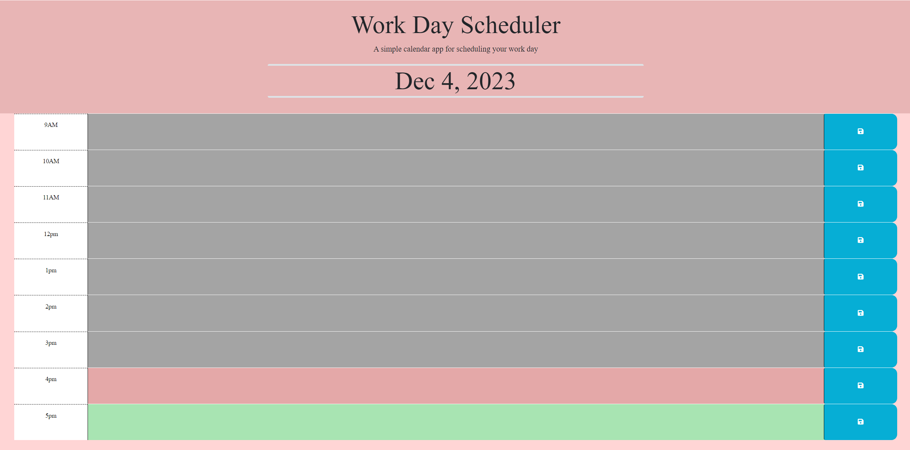

# Workday Scheduler

## Description

This is a workday scheduler that allows you to add descriptive notes to each section and save them.
The red highlighted section shows what the current hour is. The grey highlighted areas shows for times that have already passed. Green highlighted sections show the hours that are still ahead.

## Usage

### Deployed Image

### Deployed URL.
https://tyler-cav.github.io/Work-Day-Scheduler/
